# Evaluation — specification

**Status: agreed, not yet implemented.** Nothing here is frozen yet.

## Summary

This document specifies how the paper's segmentation results are scored. The
pipeline splits every video frame into regions and tracks them over time,
without naming what they are. The evaluator compares those regions with the
ground-truth (GT) masks of two datasets: ATLAS-120k (laparoscopic and
robot-assisted videos of 14 procedures, 42 classes) and CholecSeg8k
(laparoscopic cholecystectomy, 13 classes). Each count is its paper's: the
42 leave out ATLAS-120k's background, and the 13 include CholecSeg8k's.

- **One object per class in the GT, one per region in the prediction.** The
  datasets label classes, not individual things, so all pixels of one class in
  one frame form one GT object. Each predicted region is one predicted object.
  A GT object and a predicted object are paired when they overlap enough
  (IoU ≥ 0.5).
- **Every class has a type**: a tool; tissue that depth and shape can
  separate; or tissue they cannot, or that is nearly background, such as blood
  or the abdominal wall. Every metric is computed over three sets of classes,
  called *views*: all classes; tissue only, without tools; and *geometric*,
  only the tissue that depth and shape can separate.
- **Claims are judged on each dataset's own labels**, the classes its masks
  hold, each with a type of its own. For ATLAS-120k these are 47 ids, of
  which the paper's 42 classes and background occur. ATLAS-120k's benchmark
  merges them into 30 classes; those are scored too, for comparison with the
  benchmark, as reference values only.
- **Ten metrics, three questions.** The paper asks three questions of the
  regions. Two are judged on a *primary* metric of their own: what input
  puts the regions' boundaries where the GT's class boundaries are, judged
  on `boundary_R_raw` in each view; and how much of the labelled structure
  the regions hold, judged on `F1_50` (objects found, with every extra region
  counted against it) and `SQ` (how well the found ones fit), in the
  geometric view. The third, how far a region picked out in one frame can be
  followed, is answered with reference values only ("Consistency over time:
  reference values only", below).
- **Regions are named from the GT.** Each region takes the class most of its
  pixels have in the GT, so the class-map metric `mIoU` is an oracle value,
  kinder than any real classifier would get.
- **Nothing is dropped silently.** A colour or class id the tables do not know
  stops the run, and every skipped frame or pixel is counted. There is no
  minimum object size.
- **Scores say how they were made.** Each carries `eval_code_sha`, a hash of the
  evaluator's code and class tables, with its settings and hashes of its
  inputs. Two scores are compared only when these match.
- **Checked against the earlier evaluator.** The pilot measurements were scored
  by an earlier evaluator, the *pilot evaluator* (`eval_code_sha = 1f8a813a…`),
  which stays frozen in the private research workbench. Run with its rules
  (*pilot mode*), this evaluator must reproduce its scores exactly.
- **Consistency over time: reference values only.** The pilot evaluator's
  `time_IoU` is kept, as a reference value only: coarse regions score well
  on it. Measures of whether a tracked thing keeps its identity — hold, IDF1,
  ID switches, fragmentation, re-entry — are computed by a tool outside the
  evaluator and reported as reference values too. No measure over time
  carries a star.

The rest of the document gives the rules in full, then why the pilot evaluator
was replaced, then the class tables.

## The evaluator at a glance

Scoring runs in six steps. The evaluator reads a clip's inputs, scores a
frame in one view and then in all three, averages each key over the clip, and
writes one score file per condition. The tools then compare two conditions.

The second figure shows the same steps part by part. Each box names, in its
corner, the module or package that holds the part, so a rule below can be
found in the code. A module's docstring says what it returns.

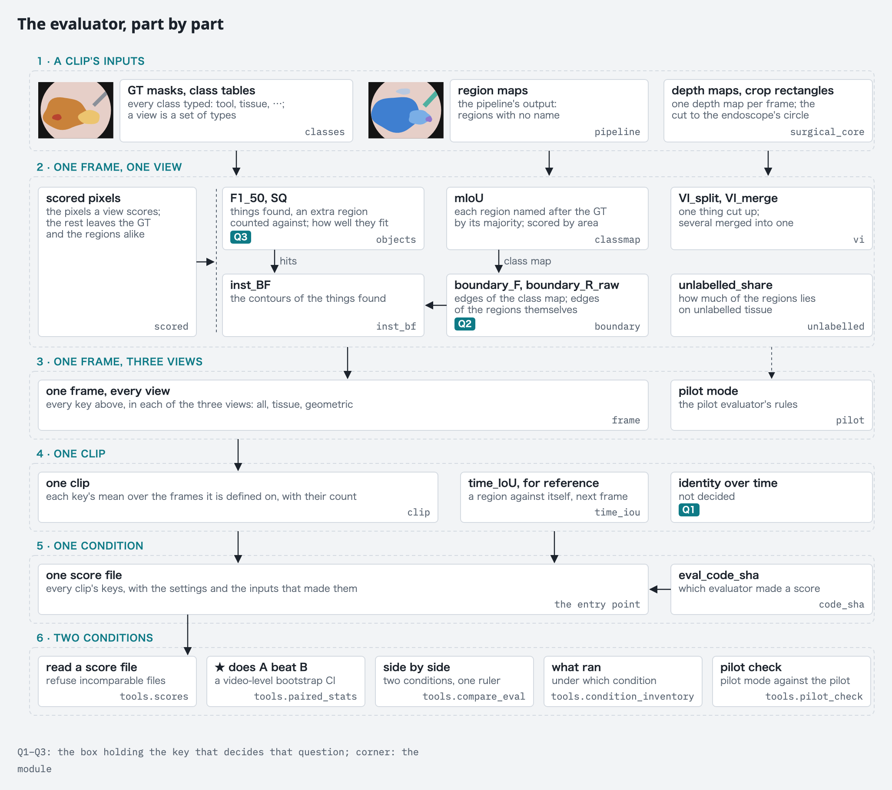

## How a frame is scored

### Inputs

- **Ground truth.** A label per pixel, read through the dataset's class
  table the same way for both datasets: the table gives every id a mask can
  hold its colour. CholecSeg8k's masks store colours. ATLAS-120k's store its
  47 original ids, as palette images read by their index, and in 34 clips as
  colours.
- **Prediction.** One region id per pixel, from tracking, with no class; −1
  means no region. The evaluator never reads a class from the pipeline. Each
  configuration of the pipeline that the paper compares — a *condition* —
  gives one prediction per clip.
- **Depth.** The Depth Anything 3 (DA3) depth map the pilot evaluator reads
  for the clip, the same for every condition scored on that clip. It sets
  the pixel grid the GT is resized to, and nothing else: this is an
  evaluation of 2D masks, and no pixel is left out because a depth model
  said nothing there. DA3 gives a finite positive depth on every pixel; a
  depth map with a pixel that is not finite or not above `DEPTH_MIN` is a
  fault in the data, and the evaluator refuses the frame rather than scoring
  the rest. It refuses an excluded frame too: the depth map is checked
  before the marker, so that a faulty depth map is found whether or not the
  frame is scored. The pilot evaluator instead scored only the pixels that passed
  that test; pilot mode keeps its test, which is why `invalid_depth` is
  among the counts below (always 0 in normal mode).
- **Crop.** The pipeline cuts each clip to the rectangle around the
  endoscope's circle. The GT mask is cut with the same rectangle before it is
  resized, so that GT and prediction cover the same pixels. The rectangle is an
  input like the mask, and is recorded and hashed with it.
- **Resolution.** GT masks are resized with nearest neighbour to the depth
  map's shape, and so is a prediction of another shape. That shape is DA3's
  input size: the longest side scaled to 504 px, then each side rounded to the
  nearest multiple of 14.
- **Time.** Frames are ordered by their timestamps, not by their file names: in
  11 of the 27 CholecSeg8k clips the frame numbers do not follow time. A
  dataset that gives no timestamps, ATLAS-120k, is ordered by frame number.
  A clip in which two frames share a time, or only some frames have one, is
  refused, since the order of its frames is unknown.
- **Clips and videos.** A *video* is one recording in the dataset. A *clip* is
  a stretch of one video that the pipeline processes as a unit, and a video
  can supply several clips. Which clips enter a measurement is data, kept in
  the population files, never a count in a name. Scores are made per clip;
  the bootstrap that decides a star resamples videos, so the clips of one
  video are never treated as independent.
- **Frame manifest.** The pipeline writes `frame_manifest.json` into each
  clip. It lists the clip's frames with their times and GT flags, and holds
  the crop rectangle.
- **Propagation rule.** A tracked condition carries its labels from one
  seed frame, under one of two rules. `both_ways_from_centre` seeds on the
  centre of the frames it labels, frame N // 2 of N, and carries both ways;
  it is the offline setting. `forward_from_first` seeds on frame 0 and
  carries forward; it is the causal setting. A condition segmented frame by
  frame has no seed, and its rule is `per_frame`. The tracker records its
  seed frame and its direction beside its labels, in `seed_info.json`, and
  the evaluator reads the rule from there. A seed from anywhere else, the
  GT for one, holds neither rule: such a condition is a comparison of its
  own, and is not scored under either. A score records the rule as
  `propagation`, and a condition whose rule is unknown is not scored.

A clip is a directory. Frame i is `frames[i]` of the frame manifest, counted
from 0, and every input of that frame sits at index i. The index is the
frame's place in the manifest, not in time; "Time" above says how the frames
are ordered. For frame 7:

| input | where | frame 7 |
|---|---|---|
| frame manifest | `frame_manifest.json`, in the clip | `frames[7]`, whose `seq_idx` is 7 |
| depth | `exports/mini_npz/results.npz`, in the clip | `depth[7]` |
| GT mask | `seg_masks/`, in the clip | `000007_color_mask.png` (CholecSeg8k), `000007_class.png` (ATLAS-120k) |
| prediction | the condition's directory for the clip, which the tracking stage writes | `label_0007.npy` |

### Which frames

The frame manifest says which frames are GT frames, and the mask files do
not. A GT frame has the dataset's GT flag (`has_seg_mask` for CholecSeg8k,
`has_gt` for ATLAS-120k), `is_anchor` true and no `seg_provenance`. The mask
files cannot decide: the pipeline also writes the viewer's SAM 3 masks into
`seg_masks/` under the GT's names, and they are not GT. A clip is refused
when a mask file has no GT flag, when a GT flag has no mask file, when a
flagged frame is neither a GT frame nor marked by `seg_provenance`, or when
a GT frame has no prediction.

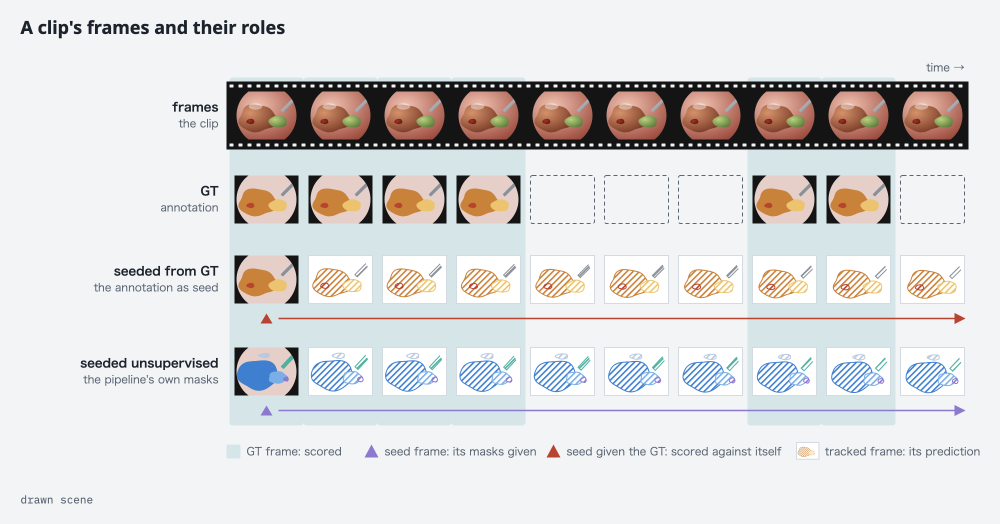

### Objects

In the GT, an object is one class's whole region in one frame. In the
prediction, an object is one region: one id in one frame.

The GT labels classes, not individuals, so a class's region is the finest unit
it can supply. This also settles classes that cover several separate things,
such as ATLAS-120k's `Tools/camera`, used for every instrument: two touching
instruments are one GT object because the dataset gives them one class, not
because they touch. (ATLAS-120k's own benchmark offers no guide here: its AP
scores a frame's whole foreground as one object.)

The definition has two costs:

- A class seen in pieces — a liver cut in two by an instrument — is still one
  object.
- A prediction that separates two things of one class — two instruments, two
  loops of small intestine — gives regions that each cover part of the object.
  At most one of them can be matched; the others count as false positives, and
  `VI_split` counts the same separation. Instruments are the common case: in
  70 % of ATLAS-120k frames with tools, the tool region is in two or more
  pieces of 300 px or more. Tools are outside the geometric view.

Objects are paired greedily, highest IoU first, each object at most once,
whatever its class. Among pairs of equal IoU, the one with the higher GT
object index is taken first, then the higher predicted index; GT objects are
indexed by class id and predicted objects by region id, both ascending. That
is the pilot evaluator's order, kept so that both modes share one rule. A pair
with IoU ≥ `MATCH_IOU` is a *hit*. `F1_50`, `SQ` and `inst_BF` are taken over
these objects.

This figure and the ones below draw one scene and run the modules on it.
Hatched pixels are not scored; "Views" says which. The pale patch next to the
tool has no depth. Normal mode would refuse such a frame. The figures leave
the patch out of the scored pixels, as pilot mode does, and score the rest by
the normal rules.

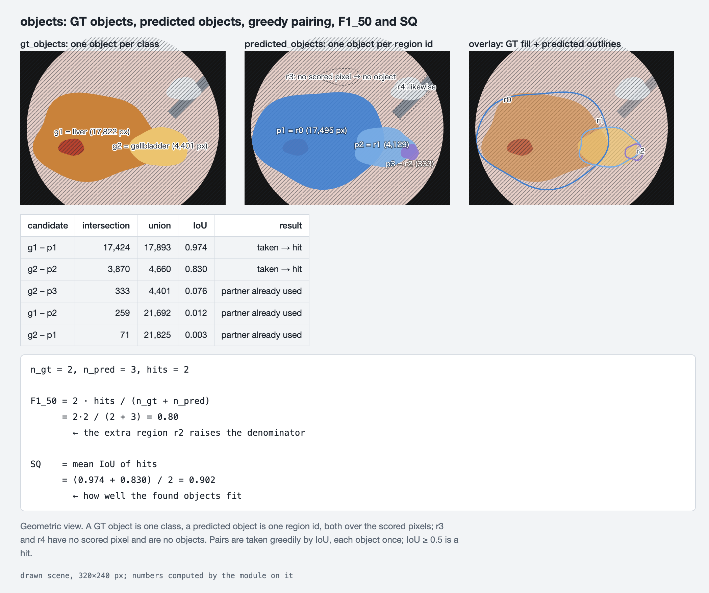

[`evalkit/objects.py`](../evalkit/objects.py) computes the numbers on this
scene.

### Naming the regions: the class map

The pipeline gives regions without classes, so `mIoU` and `boundary_F` need a
class for each region. Each region takes the class most of its scored pixels
have in the GT: a tie goes to the smaller id, and a scored pixel with no region
has no class. A region with no scored pixel gets no name and is no object. The
result is the *class map*.

The GT decides the names, so no classifier's mistakes enter `mIoU`: it is an
oracle value, kinder than any real classifier would get, and is reported as
one. It is not a bound in the strict sense: the majority vote maximises the
share of correctly named pixels, and a different naming could score a higher
`mIoU` by favouring small classes. Splitting a class into several regions costs
nothing there; `VI_split` measures splitting.

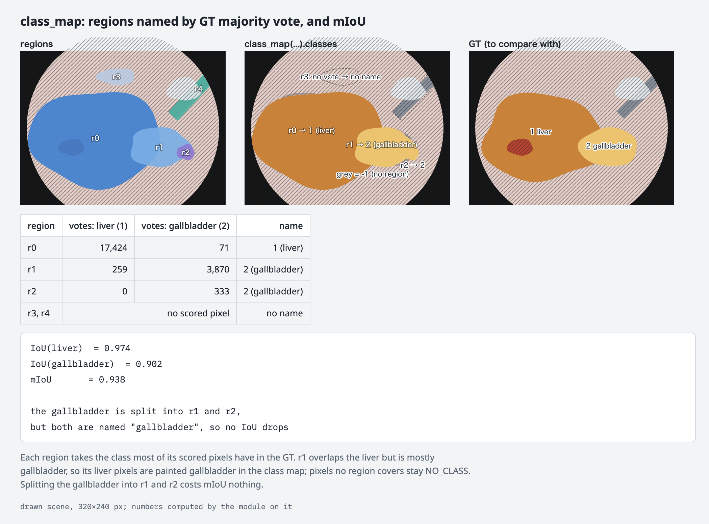

[`evalkit/classmap.py`](../evalkit/classmap.py) computes the numbers on this
scene.

### Class types

Every class gets exactly one type, listed per dataset in the class tables at
the end:

| type | meaning | scored |
|---|---|---|
| `ignored` | outside the field of view, or not a class at all | never: removed from the GT and the prediction alike, like a pixel without valid depth |
| `background` | inside the view, labelled as nothing: unlabelled anatomy, and in ATLAS-120k's benchmark classes the ids the 30-class mapping drops | never: removed like `ignored`, so a region lying on it is neither an object nor a false positive (see the views below) |
| `excluded` | a marker that takes the whole frame out of evaluation | the frame is skipped, and counted |
| `tool` | an instrument, or another object that is not anatomy (ATLAS-120k's catheters and non-anatomical structures) | in the `all` view only |
| `tissue` | anatomy that the scene's depth and shape can separate | in every view |
| `appearance` | tissue told apart only by colour or texture (blood, for one) | in the `all` and `tissue` views |
| `expert` | tissue whose boundary is set by anatomical convention — which vessel it is, where one stretch of a tube ends — so that neither shape nor colour shows it without anatomical knowledge | in the `all` and `tissue` views |
| `backdrop` | a surface the scene sits against, close to background (abdominal wall, diaphragm) | in the `all` and `tissue` views |

`expert` and `backdrop` came out of looking at every ATLAS-120k class in the
masks: many classes were neither shape nor colour, but one of these two.

### Views

Every metric is computed over each of three views, the same way:

- `all`: every class that is not `ignored`, `background` or `excluded`
- `tissue`: the same, without `tool`
- `geometric`: `tissue` classes only

A view removes the pixels of the classes it leaves out, from the GT and the
prediction alike, as it does `ignored` pixels: a prediction is neither rewarded
nor penalised there. In the geometric view, a region that runs from the liver
over the blood lying on it is not penalised for the blood, and neither is one
that stops at its edge.

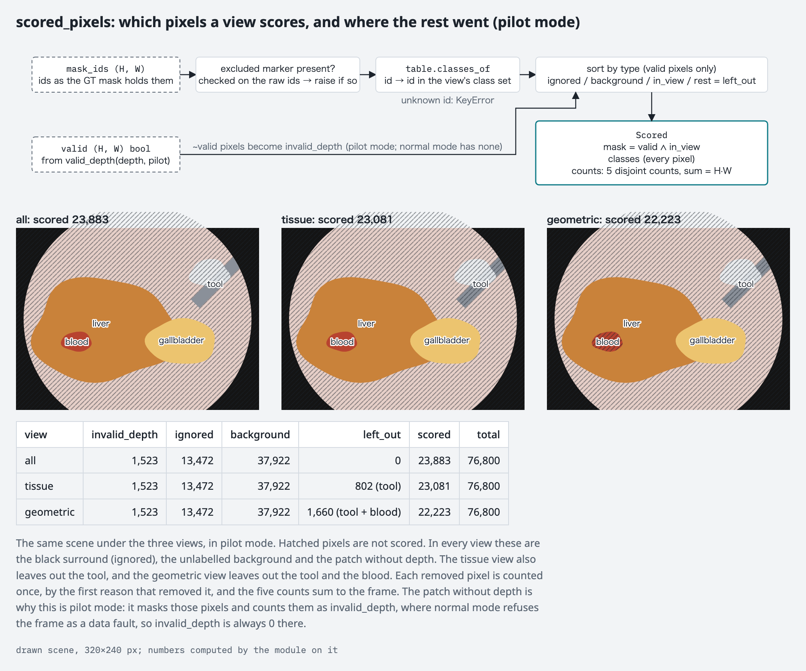

[`evalkit/scored.py`](../evalkit/scored.py) computes the numbers on this
scene, in pilot mode.

#### Why removed pixels are not filled in

The removed pixels are not filled in from their neighbours, as if the liver
ran on under the blood. Under a thin smear it does, but a fill would have to
hold for every class a view removes, and under most of them it does not: to
depth, pooled blood is a surface of its own, a tool is another object in
front, and connective tissue runs between organs, so a fill would make up
labels over large areas, by an adjacency rule that would be one more free
choice. It would also lean one way. A pipeline that follows shape keeps the
liver whole across the blood, and one that follows colour cuts the spot out;
a fill would reward the first, the behaviour depth is expected to bring, by a
rule chosen after the pilot evaluator's scores were seen. Removing the pixels
favours neither. What it cannot see is a region lying on removed pixels
only, such as a spot cut out by colour: it is no object, so it is not counted
against the condition as an extra region, and no other metric sees it either.

Where a fill would be defensible at all, a spot of `appearance` pixels whose
whole outer border is one `tissue` class, the GT has almost none. Counted
on the masks as released, before any crop: in CholecSeg8k, such spots hold
0.6 % of the `appearance` pixels and 0.04 % of the `tissue` pixels the
geometric view scores; 6 % of frames have one, and the median spot is 24 px. In ATLAS-120k's population, read every fifth mask,
6 of 21,093 frames have one, holding 0.008 % of the `appearance` pixels.
Removing and filling differ on almost no pixel, so nothing is counted for
the difference.

#### Background

Background is removed in every view, the same way. What the datasets call
background is not empty space: it is anatomy nobody labelled, and in
ATLAS-120k's benchmark classes also the kidney, pancreas and the other classes
the 30-class mapping drops. A region the pipeline places there is not an
error, so it is neither an object nor a false positive, and no metric sees
it. The one surface that is close to nothing, the abdominal wall, is a class
of its own (`backdrop`) and is scored in the `all` and `tissue` views. This is
the pilot evaluator's `labeled` domain, made for the same reason; its `full`
domain, which counted a region over unlabelled anatomy as a false positive, is
not carried over.

So a region that spills from a labelled organ into unlabelled tissue is
scored as if it stopped at the organ's edge: the spill costs nothing. That
is the convention of panoptic quality, where a segment's void pixels leave
the union and a segment lying mostly on void is no false positive. The other
convention, the Cityscapes instance evaluation, keeps the spill in the union
and so penalises it. It is not used here because ATLAS-120k's unlabelled
pixels include organs painted only in part: in some clips a mesentery stops
at a free-hand line while the same fat visibly continues, and there a region
that follows the organ past the paint would be penalised for being right.
What the scores cannot see is counted instead, as `unlabelled_share` below.

## Metrics

| what it measures | key | better | same key in the pilot evaluator | pilot keys it replaces |
|---|---|---|---|---|
| objects found | `F1_50` | higher | `inst_F1_50` | the recognition quality of PQ (panoptic quality) |
| how well found objects fit | `SQ` | higher | `SQ` | `PQ`, `inst_F1_avg`, `inst_F1_75` |
| how well found objects' contours fit | `inst_BF` | higher | `inst_BF` | — |
| class map, by area | `mIoU` | higher | `GT_mIoU` | `GT_mDice` |
| class map, by contour | `boundary_F` | higher | `boundary_F` | `boundary_P`, `boundary_R`, tolerances 1 / 3 / 5 |
| boundaries found before any class is assigned | `boundary_R_raw` | higher | `boundary_R_raw` | `boundary_P_raw`, its tolerances |
| splitting | `VI_split` | lower | `VI_split` | `overseg_mean` |
| merging | `VI_merge` | lower | `VI_merge` | `underseg_error` |
| consistency over time | `time_IoU` | reference only | `time_IoU` | — |
| how much of the regions lies on unlabelled tissue | `unlabelled_share` | reference only | — | — |

### What each key is, per frame

#### Objects found and how well they fit: `F1_50`, `SQ`, `inst_BF`

- `F1_50` = 2 · hits / (GT objects + predicted objects).
- `SQ` is the mean IoU of the hits. `inst_BF` is the mean, over the hits, of
  the boundary F between the predicted object's contour and the GT object's,
  each marked by the boundary rule below over the scored pixels.

The figure under "Objects" shows `F1_50` and `SQ`. The figure of `inst_BF`
comes after the boundary rule it uses, under "Boundaries".

#### The class map, by area: `mIoU`

`mIoU` is the mean IoU over the classes in the GT or the class map,
background excluded. The figure under "Naming the regions: the class map"
shows it.

#### Boundaries: `boundary_F`, `boundary_R_raw`

- `boundary_F` compares the class map's boundaries with the GT's.
  `boundary_R_raw` is the share of the GT's class boundaries that the regions'
  own boundaries recover, before any class is assigned, so an extra cut costs
  it nothing.
- A boundary pixel is one whose left, right, upper or lower neighbour is a
  scored pixel with another label. An edge against a removed pixel (ignored,
  background, or a class the view leaves out) is not a boundary, so a region
  is neither rewarded nor penalised for where it ends against them. Both sides
  of an edge are marked, so a boundary is 2 px wide. The tolerance is a
  square dilation by `BOUNDARY_TOL_PX`. An edge shifted by `BOUNDARY_TOL_PX`
  px scores 1, one shifted by `BOUNDARY_TOL_PX` + 1 px scores 1/2, and one
  further off scores 0. A frame whose scored pixels are all one class has
  no GT boundary, which is common once a view has removed the rest (a frame
  showing only liver, in the geometric view); the boundary metrics are not
  defined on it, and it is counted. When only the prediction's boundary is
  empty, they score 0.

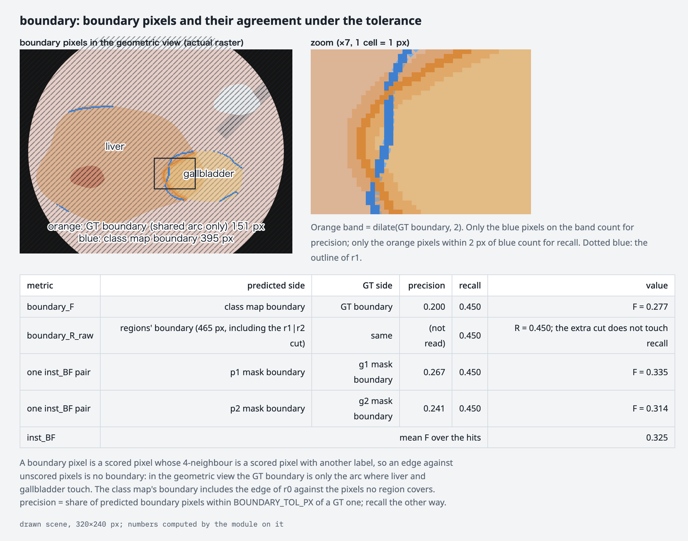

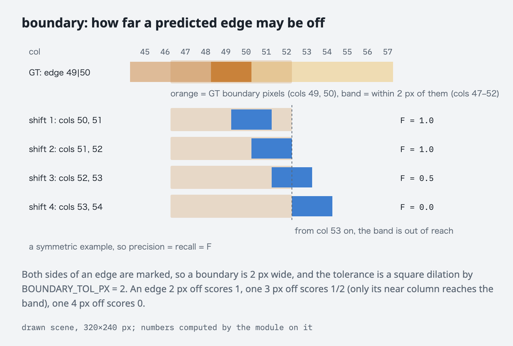

[`evalkit/boundary.py`](../evalkit/boundary.py) computes the numbers in both
figures.

`inst_BF` applies the same rule to the contour of each hit.

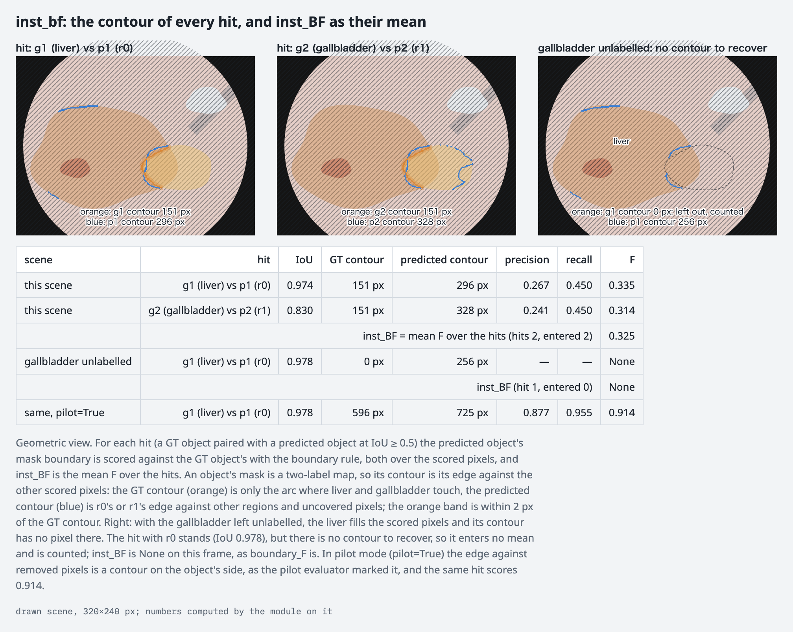

[`evalkit/inst_bf.py`](../evalkit/inst_bf.py) computes the numbers on this
scene.

#### Splitting and merging: `VI_split`, `VI_merge`

`VI_split` = H(regions | GT) and `VI_merge` = H(GT | regions), the two halves
of the variation of information, in bits, over the scored pixels. The pixels
with no region count together as one region. On a frame with no scored pixel
they are not defined, and the frame is counted.

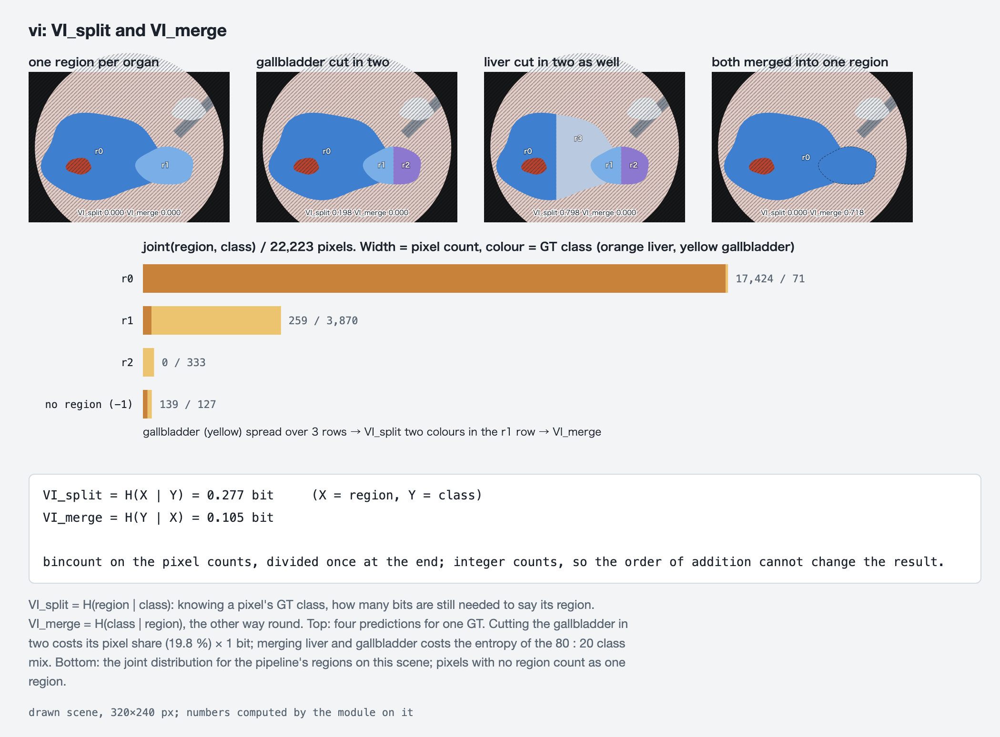

[`evalkit/vi.py`](../evalkit/vi.py) computes the numbers on this scene.

#### Over time: `time_IoU`

`time_IoU` is a region id's IoU with itself in the next frame. Unlike the
other metrics it is one number per clip: the IoUs of every (id, frame pair)
are pooled over all tracked frames, with or without GT, and averaged.

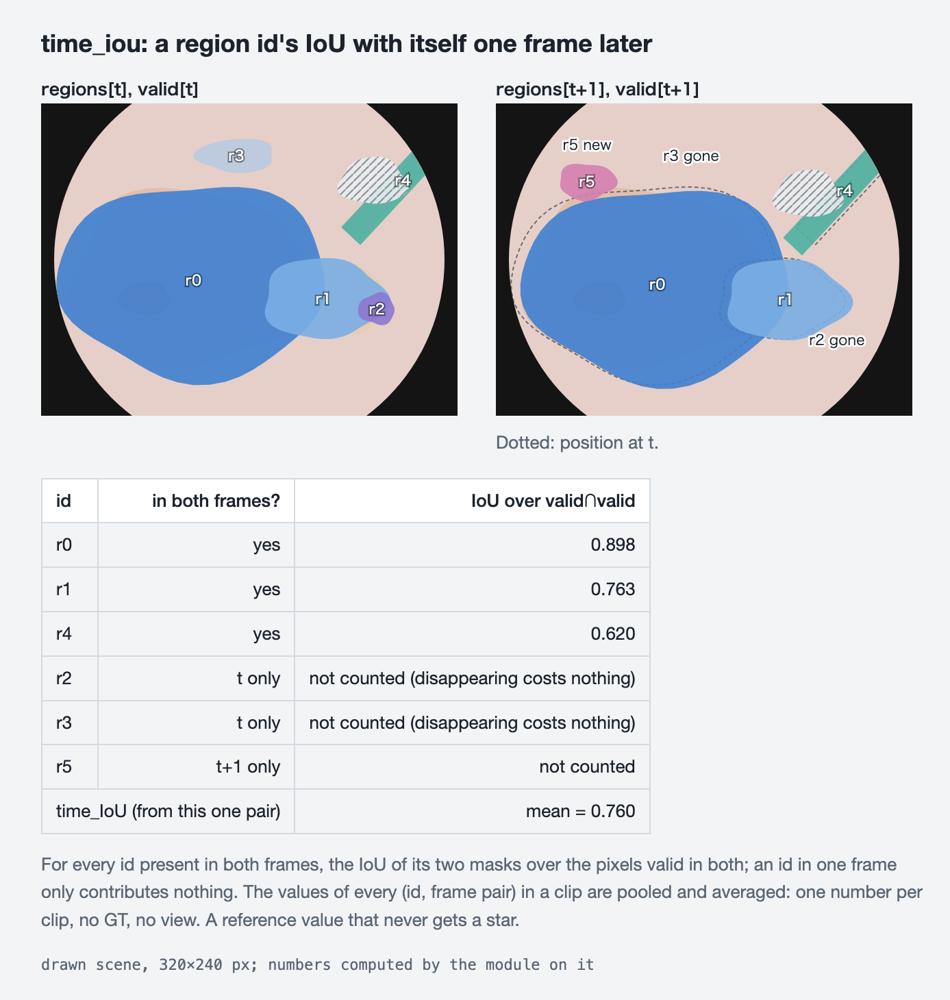

[`evalkit/time_iou.py`](../evalkit/time_iou.py) computes the numbers on these
frames.

#### The spill no other key sees: `unlabelled_share`

`unlabelled_share` is, over the regions that have a scored pixel, the share
of their pixels lying on background among their pixels on scored or
background pixels: the spill the other keys cannot see. A region on
background alone is not among them, as it is no object, and pixels the view
removed for another reason are in neither count. It reads no GT class, only
where the GT is unlabelled, and gets no star. It is reported beside a
comparison whose two conditions differ in it by much, as the pilot
measurements did for the share of pixels left without a region.

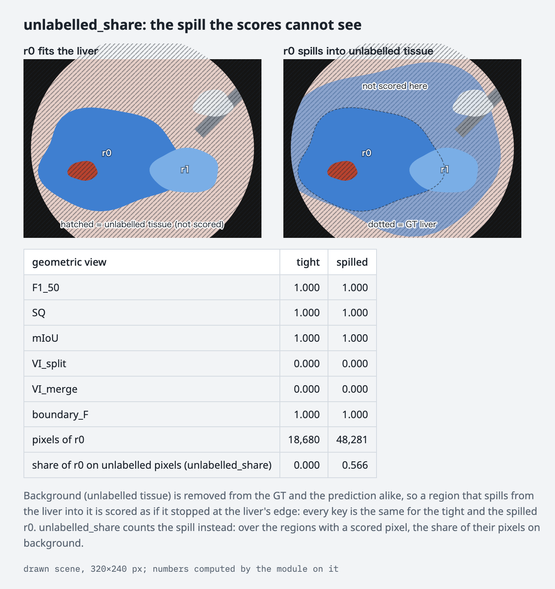

[`evalkit/unlabelled.py`](../evalkit/unlabelled.py) computes the numbers on
this scene.

### From frames to clips

Every metric but `time_IoU` is computed per frame and averaged over a clip's
GT frames; `time_IoU` is pooled over the clip as described above. The clip
values are what `paired_stats` resamples, by video, to decide whether a claim
gets a star: the rule in `AGENTS.md`, a video-level bootstrap 95 % CI that
does not straddle zero. The JSON keeps the per-frame values.

A metric is not defined on some frames: `F1_50` on a frame with no GT object,
`SQ` and `inst_BF` on a frame with no hit, `mIoU` on a frame with no class,
`unlabelled_share` on a frame with no region on a scored pixel. `inst_BF`
also leaves out a hit whose GT object has no boundary pixel, because its
contour lies wholly against removed pixels (the one object of a frame that
fills the scored pixels, or one cut off from every other class by a tool),
and is not defined when no hit remains; the hits left out are counted.
Those frames do not enter the mean, and the number of frames each mean covers
is recorded. `time_IoU` is not defined on a clip where nothing is pooled: a
clip of one frame, or one in which no id is present in two consecutive frames
with some valid pixel under it. Two conditions can cover different frames, and comparing them
without the counts once flipped the sign of a pilot result.

PQ is not stored. When a table wants it, it is SQ × F1_50 per frame, taken from
the per-frame values, with one rule that the product alone would miss: a frame
that has GT objects but no hit has PQ = 0, although its `SQ` is not defined.
Leaving such frames out would lift PQ above its usual definition, which the
pilot evaluator follows. Counts (frames, objects, regions) are kept as
diagnostics and never get a star.

### Primary metrics

The paper asks three questions, each as a comparison between two
conditions, and judges two of them on a key of their own, on each dataset's
own labels (the `original` class set):

| question | primary metric | view |
|---|---|---|
| Given one frame as an example, how far can the regions be followed? | none: reference values only (below) | — |
| Given no example, what input puts the regions' boundaries where the GT's class boundaries are? | `boundary_R_raw` | each of the three |
| Given no GT, how much of the labelled structure is already in the regions? | `F1_50` and `SQ` | geometric |

The second question is answered within each view, between conditions that
differ in what the pipeline is given: the image, the depth, or both. The
views sort the classes by what should separate them, so the answer can
differ from one view to the next.

These were chosen before any score of this evaluator was looked at. The
pilot evaluator's scores of the same quantities have been seen, which is why
the choice is fixed before this evaluator scores anything.

The set is kept as small as the claims allow. The evaluator computes every
metric in the table; which of them the paper reports is settled before any
score of this evaluator is seen.

### Consistency over time: reference values only

`time_IoU` is kept only as a reference value and never gets a star. It uses no
GT, and the workbench measured three faults in it:

- it rises as regions get coarser, and one region covering the whole frame
  scores 1.0;
- an id that disappears costs nothing;
- for a condition segmented frame by frame, whose ids do not carry over from
  one frame to the next, it means nothing.

`temporal_f1`, built to close the second fault, keeps the first.

The measures of identity against the GT come from the workbench's
`track_metrics`: hold (whether the region picked on the seed frame still
covers the same GT thing on the GT frames seconds before or after it), IDF1,
ID switches, fragmentation and re-entry. The evaluator computes none of
them. Each needs a GT track, and the datasets carry no ids for individual
things, so a GT track would be a second object definition, in addition to
the whole-class object used above. The workbench also measured a fault in
four of them, and the fifth depends on how the GT track is linked:

- two of hold's pre-registered denominators gave one comparison opposite
  signs: `hold_mean` averages over the GT tracks the condition picked a
  region for on the seed frame, and `hold_all_mean` over every GT track
  present on that frame, counting a track without a region as 0;
- IDF1 rises when regions merge;
- ID switches cannot tell a tracker from a floor that never moves: one mask
  pasted on every frame scores close to zero;
- re-entry counts a gap of at most three observations in a GT track, not a
  return to the field of view, and it leaves out every gap whose two ends
  are not both matched: about a third of the gaps for a tracker in the
  workbench, and nine in ten for the pasted floor, which then scored 1.0 on
  the rest;
- fragmentation changes with how the GT track is linked, so its value is a
  property of the track definition as much as of the condition.

So a tool outside the evaluator, `evalkit/tools/track_metrics`, computes the
measures of identity, and they are reported as reference values: in a table
that carries no star. The tool's GT track is an open question
(`docs/porting.md`, "The GT track of `track_metrics`"). A measure that is to
carry a star would have to be computed by the evaluator before the
evaluator is frozen, and none is.

## Rules that keep the numbers honest

### Thresholds

| name | value | why |
|---|---|---|
| `BOUNDARY_TOL_PX` | 2 | the pilot evaluator's value for its main boundary keys; what it allows is given with the boundary definition above |
| `DEPTH_MIN` | 10⁻⁶ | the pilot evaluator's test of a depth value, finite and above this; in normal mode a pixel that fails it refuses the frame, in pilot mode it is masked out |
| `MATCH_IOU` | 0.5, as IoU ≥ 0.5 after greedy pairing | the pilot evaluator's rule. PQ's convention, IoU > 0.5, makes a pairing unique; at exactly 0.5 the greedy order given with the objects decides |

There is no minimum object size. The pilot evaluator dropped connected
components and predicted regions under 300 px. With whole-class objects, a
sliver joins its class's region instead of becoming an object, so a cut would
only decide whether a small class counts at all, and nothing in the data sets
that size. Pilot mode keeps the cut, as `PILOT_MIN_CC_PX`, and nothing else
uses it.

### Fail closed

- A colour or id missing from the dataset's class table raises; it is never
  mapped to background. ATLAS-120k's benchmark code sends unknown ids to
  background, and reads a mask through `.convert("L")`, which turns a palette
  mask into the brightness of its palette colours rather than its ids; it is
  not reused as code.
- A palette mask is read by its index, never through the palette it embeds.
  ATLAS-120k's masks embed seven different palettes, and some of them give
  some of ids 43–46 black, or Ligated plexus the colour of Liver.
- A mask reaches the table as the image its file holds, not as an array: an
  array does not say whether its channels are RGB or BGR, and six pairs of
  ATLAS-120k colours swap under that mistake, Artery and Vein among them.
- A single-channel CholecSeg8k mask is refused: those are the watershed
  masks, whose codes are not the table's ids. An RGBA mask is read only when
  every pixel is opaque; four CholecSeg8k colour masks are RGBA, alpha 255.
- The CholecSeg8k table maps (0, 50, 128) to Hepatic Vein. The dataset's
  watershed codes settle it (see the measurements below).
- (255, 255, 255), the line CholecSeg8k draws between regions, and
  CholecSeg8k's Black Background are `ignored`.
- `Excluded frames` is checked on ATLAS-120k's original ids, before they are
  mapped to the 30 classes, which would turn it into background. In a mask
  stored as colours it cannot be seen: its colour in the dataset's palette is
  Background's, (0, 0, 0). There (0, 0, 0) reads as Background, and a colour
  mask of background alone, the one frame the marker could hide in, is
  refused. The marker occurs in no palette mask of the release, and no colour
  mask is background alone.
- Nothing is dropped without a count: skipped frames, ignored, background and
  invalid pixels, the pixels each view removes, and the frames a metric is not
  defined on are counted in the JSON. A removed pixel is counted once, by the
  first reason that removes it, in this order: invalid depth, then `ignored`,
  then `background`, then a class the view leaves out. So a frame's counts
  are disjoint and sum to its pixels, and a black corner without depth counts
  as invalid depth, not as ignored. The order is a convention: another one
  would change the counts and no score, but the JSON is read against this one.

### Recorded with every score

- `eval_code_sha`, which covers the class tables as well as the code, so a
  changed type is a new evaluator
- the dataset, the class set (`original`, or for ATLAS-120k also
  `benchmark`), the view, and whether the score was made in pilot mode
- a sha256 hash of every input read, per clip, as `input_shas`: the GT
  masks, the depth maps (as `atlas120k_meta/depth_manifest.json`
  fingerprints them), the crop rectangle, the frames in time order, and the
  predictions
- the name of the directory the predictions were read from, as
  `track_dir_name`, which is how `condition_inventory` matches a score to
  its labels; a score that does not say what it scored cannot be inventoried
- the condition's propagation rule, as `propagation` ("Propagation rule"
  above)
- the Python, numpy, OpenCV and Pillow versions

The pilot evaluator's JSONs recorded no input hashes, propagation rule or
versions.

A score JSON holds those fields, `clips` (the population, in its order),
and one row per clip under `per_clip`. A row holds the clip's name, every
key (`metric/view`, then `time_IoU`), and the counts behind them: `n_frames`,
the frames each key's mean covers, by key; the scored and excluded frames;
`pixels`, where each view's pixels went; and `objects`, the GT objects,
predicted objects, hits and hits that entered `inst_BF`, per view. Its
`frames` keeps every GT frame's values, by frame number, in time order.

Two scores are comparable only when all of these hold:

- their `eval_code_sha`, dataset, class set, view and mode match;
- they cover the same clips;
- they read the same GT masks and depth maps;
- they share a propagation rule, or one of them is `per_frame`.

The same `eval_code_sha` is not enough on its own. Pilot mode and the
normal mode share it, and so do the views.

Conditions under two different propagation rules are never compared. The
difference between the rules would look like a difference between the
methods. A `per_frame` condition is the exception: it may be compared with
a condition of either rule. The paper compares tracking with per-frame
segmentation. So one table holds one rule, plus any `per_frame` conditions.

The tools enforce this:

- `compare_eval` refuses a pair that is not comparable.
- `paired_stats` refuses such a pair too, and a table that holds two rules
  other than `per_frame`.
- `paired_table` and `arms_paired` refuse a table that holds two
  conditions that are not comparable.
- `claims_table` refuses a column in which any two score JSONs are not
  comparable.
- All five report a difference in library versions but do not refuse it.

The check against the pilot evaluator, below, is not bound by these
conditions: the two `eval_code_sha` differ by construction. Its own script,
outside `compare_eval`, verifies that this evaluator in pilot mode writes the
pilot evaluator's numbers.

### Terms the tools read a score with

- A *score JSON* is one condition's scores: a summary and one *row* per
  clip, under `per_clip`. A *key* is one column of the rows: the evaluator
  writes `metric/view` (`F1_50/geometric`) and `time_IoU` once per clip; a
  *pilot JSON*, one the pilot evaluator wrote, is told apart by holding none
  of the class set, views, mode, input hashes, versions and propagation rule
  (`scores.EVALUATOR_FIELDS`) and keeps the pilot evaluator's spellings
  (`inst_F1_50`, `inst_F1_50_tissue`, with the domain after an underscore).
  A JSON this evaluator writes in pilot mode is not a pilot JSON.
- A *ruler* is what a score was measured with, as `scores.Ruler` holds it:
  `eval_code_sha`, dataset, mode, class set, views, and for a pilot JSON its
  domain. Two scores are *comparable* when they share a ruler, cover the
  same clips, read the same GT masks and depth maps, and share a
  propagation rule unless one of them is `per_frame`.
- A *tag* is a condition's name on disk: the directory under each clip that
  holds its labels, and separately the name of its score JSON; the score
  names the label directory it read in `track_dir_name`.
- In a comparison, *base* is the condition compared against and *cond* the
  one compared; a difference is `cond − base`. A key's *direction* is the
  way it is better: higher, lower, or neither for a reference value, as the
  `better` column of the metrics table gives it. The
  *population* is the clips the two are compared on, `identical` when both
  hold the same clips and `intersection` when compared on the common ones;
  per key it shrinks to the clips on which both define it. The *wins* on a
  key are the clips on which it moved the better way, among those.

### Checked against the pilot evaluator

- Pilot mode runs this evaluator with the pilot evaluator's rules:
  - ATLAS-120k's 47 original ids;
  - the pilot evaluator's CholecSeg8k colour table, which maps unknown colours
    to background — the one place anything becomes background silently,
    allowed because pilot mode exists only for this check;
  - the pilot evaluator's four domains (`full`, `labeled`, `tissue`,
    `labeled_tissue`, with its instrument ids) in place of the views, for the
    instance metrics; the class map and the boundary metrics on the `full`
    domain as the pilot evaluator computed them, with background pixels
    voting on a region's name and an edge against background counted as a
    boundary; VI on the `labeled` domain, the valid pixels whose GT is not
    background, which is the mask the pilot evaluator computed it on, with
    its `extra_ignore` set empty, as every score that records it has it
    (the workshop's; the 38 conditions' JSONs are checked before pilot mode
    relies on it), so the pilot's one `VI_split` is the evaluator's
    `VI_split/labeled`, and the same for `VI_merge`;
  - per-class 8-connected components of at least `PILOT_MIN_CC_PX` as GT
    objects, and regions of at least that size as predicted objects;
  - the pixels whose depth is not finite or not above `DEPTH_MIN` masked
    out and counted, where normal mode refuses the frame;
  - frames in file order for `time_IoU`;
  - the pilot evaluator's values in place of undefined ones, zeros where it
    wrote zeros and None where it wrote None: a frame with no class enters
    the `mIoU` mean as 0; a clip on which no frame has a GT object in a
    domain writes `F1_50` as 0 in the `full` domain and as None in the other
    three, and `SQ` and `inst_BF` as None in every domain, there being no
    hit to average; a frame whose GT boundary is empty scores 0 on the
    boundary metrics rather than being left out; and a clip on which
    `time_IoU` pools nothing writes 0 for it.
- Pilot mode reads a clip as normal mode does, and refuses every input
  normal mode refuses. The pilot evaluator accepted some faulty inputs
  silently, a frame with two prediction files among them; pilot mode does
  not, because a fault in the data is not a rule to reproduce. So the GT
  frames come from the frame manifest too. On the data the pilot evaluator
  scored, its mask files were exactly these frames.
- On the 38 conditions already scored, apart from those that hold neither
  propagation rule, pilot mode must reproduce every key it shares with the
  pilot evaluator — the metrics table names them, and their per-domain
  variants — at zero tolerance: the values written must be equal, and so
  must the number of frames behind each. Ties are broken as the pilot
  evaluator breaks them. The check runs where the pilot evaluator and its
  scores are, and takes their paths as arguments.
- Every difference in the normal mode then comes from a rule this document
  changes, and is listed.
- A score made in pilot mode is marked as such and never enters a comparison
  with a normal one.
- Pilot mode reads a condition's propagation rule as normal mode does. So it
  refuses a condition that holds neither rule, a condition seeded from GT
  among them, and the check leaves such a condition out by name. The paper
  reports none of them, and the other conditions run the same metric code.
- Pilot mode exists for this check alone. It is removed from the evaluator
  once the check has passed and before the evaluator is frozen, so the
  frozen evaluator has one mode.

## Why the pilot evaluator was replaced

The pilot evaluator cannot be corrected in place: any changed byte moves its
`eval_code_sha`. Three kinds of problem make correcting it worth a new
evaluator.

### 1. The metrics overlap

The pilot evaluator writes about 85 summary keys per clip, counting each
metric once per domain and per tolerance, and they carry about nine
independent quantities. Four relations hold exactly, frame by frame; each was
confirmed by running the pilot evaluator's own functions on 366 synthetic
frames:

| relation | why |
|---|---|
| PQ = SQ × F1@0.5 | F1@0.5 is PQ's recognition quality, RQ |
| 2·PQ − F1@0.5 ≤ F1_avg ≤ 2·PQ − 0.9·F1@0.5 | every F1@t has the same denominator, \|GT\| + \|pred\|, so averaging over t sums the matched IoUs in steps |
| Dice = 2·IoU / (1 + IoU), per class | both come from the same intersection and union |
| boundary_F = harmonic mean of boundary_P and boundary_R | its definition |

The others overlap in meaning rather than by formula. `overseg_mean` and
`VI_split` both measure splitting, and `underseg_error` and `VI_merge` both
measure merging. The boundary tolerances 1, 2, 3 and 5 are points on one
monotone curve. Each instance metric is also repeated over four domains.

Many overlapping keys count one improvement several times. They also make it
likely that some key reaches a star by chance.

### 2. Class handling is ad hoc

- **Classes that cover several things.** The pilot evaluator's GT objects are
  per-class connected components, and that breaks on classes that lump
  distinct things together:
  - ATLAS-120k has one class, `Tools/camera`, for every instrument, so
    touching instruments are one GT object.
  - CholecSeg8k's authors describe *Gastrointestinal Tract* (stomach, small
    intestine, nearby tissue) and *Liver Ligament* (several ligaments and the
    lesser omentum) as broad classes.
- **No class types.** Which classes are tools lives in the pilot evaluator's
  `eval_track.py` (`INSTRUMENT_CLASSES`), and reaches only the instance metrics
  of its `tissue` domains. Classes that geometry cannot recover — blood, for one
  — can be dropped only through `--extra_ignore`. That reaches only the instance
  and VI metrics, and even there it removes the GT objects but not the
  predicted pixels on them. `eval_gt_clips.py` never passes it, so no score it
  wrote used it. ATLAS-120k classes have no type at all beyond tool.
- **The datasets' own protocols are not offered.** ATLAS-120k's benchmark code,
  ATLAS-bench, maps every mask to 30 classes before scoring. The dataset's label
  table carries the same mapping as its `train_id` column. It merges similar
  classes (Omentum and Mesenterium into Fat, Aorta into Artery, Vena cava,
  Hepatic vein and V azygos into Vein), and the label table says the classes
  mapped to 0 "are either excluded from evaluation or merged into the
  background"; the benchmark merges them into background. The pilot evaluator
  scores only the 47 original ids, so none of its numbers can be set beside
  the benchmark's classes. Only id 0 counts as background there, so `Excluded
  frames` (42), a marker rather than anatomy, would be scored as foreground.
- **A CholecSeg8k class is never read.** The pilot evaluator's colour table
  gives Hepatic Vein as (0, 255, 0), a colour no mask in the dataset contains.
  Its pixels are (0, 50, 128), which the pilot evaluator reads as background.

### 3. Silent drops

- CholecSeg8k colours missing from the colour table become background without
  a word, and background is excluded from nearly every metric.
- Connected components and predicted regions under 300 px are dropped from the
  instance metrics: neither missed nor false, and not counted. The count is
  taken at the evaluation resolution, so what 300 px means depends on it.
- A comment in the pilot evaluator says a fragment counts towards `overseg` if
  it covers "5 % or 200 px" of a class; the code requires both.
- A frame is a GT frame when a mask file exists for it, so the viewer's SAM 3
  masks would be scored as GT without a word.

### What the pilot evaluator's handling changes, measured on the GT

The masks were resized with nearest neighbour to the depth maps' shape, as the
pilot evaluator does. Most frames are 504 px wide and 252 to 504 px high; four
portrait ATLAS-120k clips (73 GT frames) are 476 px wide and 504 px high.

**ATLAS-120k: 315 clips, 7,698 GT frames**

| | |
|---|---|
| `Excluded frames` (42) | in no frame |
| classes the 30-class protocol drops (Kidney, Ureter, Mesocolon, Adrenal gland, Pancreas, Duodenum) | in 835 frames (10.8 %), 2.25 % of pixels; the pilot evaluator scores them as foreground |
| ids outside the 47-class table | none |
| the 30 classes instead of the 47 original ids | changes the GT object count of 910 frames (11.8 %); objects −2.3 %, foreground pixels −2.9 % |
| `Tools/camera` connected components ≥ 300 px, per frame with tools | 1 in 2,256 frames, 2 in 3,869, 3 or more in 1,395, none in 15. How many are touching instruments merged into one cannot be told from the GT. |
| 300 px cut | drops 14.2 % of GT components, 0.05 % of foreground pixels. A class vanishes from a frame's instance evaluation in 1.2 % of (frame, class) pairs; the worst is Catheter, 19 of 64. |

**CholecSeg8k: 9 clips, 167 GT frames**

These are the nine clips on the machine the measurements were made on, a part
of the CholecSeg8k population the paper scores. The viewer's SAM 3 masks on
103 more frames are not GT and are left out (see "Which frames"). The rows
show the kind and rough size of each effect, not the population's numbers.

| | |
|---|---|
| Hepatic Vein | in 20 frames (12.0 %) of 3 clips, all read as background: 11 GT objects of 300 px or more never scored. |
| colours outside the table | 0.088 % of pixels, all silently background: (0, 50, 128), which is Hepatic Vein, on 28,054 px, and (255, 255, 255) on 3,978 px |
| 300 px cut | drops 17.9 % of GT components, but 180 of the 416 dropped are under 10 px (slivers from resizing and annotation), so only 0.07 % of foreground pixels. A class vanishes from a frame in 1.1 % of (frame, class) pairs; the worst is Gastrointestinal Tract, 4 of 98. |
| Black Background | the pipeline crops each clip to the rectangle around the endoscope's circle, which keeps its corners: 0.1 % of pixels, 0.2 % in one clip. They have valid depth, so the pilot evaluator scores them as background. |

**Which colour is which CholecSeg8k class.** All 8,080 frames of the original
dataset were checked against the dataset's watershed masks, which carry a class
code per pixel:

- Each of the 12 classes other than Hepatic Vein has one colour and one code.
- The one remaining code, 33, belongs only to (0, 50, 128), on 314,317 px in
  317 frames.
- (0, 255, 0) occurs in no frame.
- (255, 255, 255) carries code 255: it is the line drawn between regions, not a
  class.
- Every pixel of the 8,080 colour masks is one of these 14 colours.

**How CholecSeg8k's labels were made.** The annotators drew strokes of each
class, and the watershed masks fill the rest of the frame from them. Over the
8,080 frames, 24.3 % of the pixels were drawn; the rest took the class of the
stroke the fill reached. So a region's boundary is the watershed's, not the
annotator's, and a stroke placed in the wrong region labels that whole region:
in video12 frame 20024, a Gallbladder stroke labels a region the class review
read as abdominal wall.

What this says:

- The 300 px cut removes slivers from connected components. Under this
  evaluator's objects a sliver joins its class's region, so the cut is not
  needed.
- `Excluded frames` does not occur, but this evaluator handles it explicitly
  anyway.
- Hepatic Vein is a plain error in the pilot evaluator's ground truth. It is
  small in the pixels it touches, but no CholecSeg8k pilot score includes the
  class.
- The 47 original ids against the 30 classes is a choice, not an error, and it
  moves ATLAS-120k's ground truth by 2–3 %.
- CholecSeg8k's black corners are outside the view, not background.
- CholecSeg8k's boundaries are the watershed's, which is worth knowing when its
  boundary metrics are read.
- The other substantive issues are the class types and the classes that cover
  several things.

## Class tables

Each table is a data file, one per dataset: every class's type, the colour of
every id a mask can hold, and for ATLAS-120k the mapping of its 47 ids to the
30 classes. The files are hashed into `eval_code_sha` with the code.

### CholecSeg8k

Every class was looked at in the masks, as for ATLAS-120k:

| id | class | colour | type |
|---:|---|---|---|
| 0 | Black Background | (127, 127, 127) | ignored: the endoscope's black surround, outside the view |
| 1 | Abdominal Wall | (210, 140, 140) | backdrop, as in ATLAS-120k |
| 2 | Liver | (255, 114, 114) | tissue |
| 3 | Gastrointestinal Tract | (231, 70, 156) | tissue |
| 4 | Fat | (186, 183, 75) | tissue |
| 5 | Grasper | (170, 255, 0) | tool |
| 6 | Connective Tissue | (255, 85, 0) | appearance |
| 7 | Blood | (255, 0, 0) | appearance |
| 8 | Cystic Duct | (255, 255, 0) | expert |
| 9 | L-hook Electrocautery | (169, 255, 184) | tool |
| 10 | Gallbladder | (255, 160, 165) | tissue |
| 11 | Hepatic Vein | (0, 50, 128) | expert |
| 12 | Liver Ligament | (111, 74, 0) | tissue |
| 13 | Region line | (255, 255, 255) | ignored: the line drawn between regions. Not a class of the dataset; the table gives it an id so that a GT id map can hold it, and nothing scores it |

Cystic Duct is `expert`, as ATLAS-120k's Cystic duct is: the class ends where
the anatomical stretch ends. Only ATLAS-120k's benchmark, which merges the
ducts into Bile/lymph duct, types them `tissue`. Hepatic Vein is `expert` because telling it from other
vessels takes anatomical knowledge. Neither moves much: Cystic Duct occurs in 3
of the 17 videos, Hepatic Vein in 1.

### ATLAS-120k: ids, classes and colours

ATLAS-120k's label table, `atlas120k_tools/classes.py` in the ATLAS
repository, lists 47 ids, 0 to 46: Background and 46 labels. Every mask of the
release was read: 119,405 masks in 492 of its 502 clips (the other 1,613
frames its clip index lists ship without a mask).

| | |
|---|---|
| ids that occur | every id from 0 to 46 but Hepatic vein (15), Thoracic duct (38), Nerves (39) and Excluded frames (42); none above 46 |
| classes | the 42 labels that occur are the paper's 42 classes, and its Fig. 2 legend lists exactly them |
| storage | 115,024 palette masks, whose index is the id, and 4,381 RGB masks in 34 clips of 7 videos; 7 of those clips hold both kinds |
| colours of the RGB masks | 20 colours, each the one the label table gives its id. In one video, 441 frames belong to two adjacent clips, stored once as a palette mask and once in colour, and both read as the same ids |
| palettes the palette masks embed | seven versions. Against the label table, five give some of ids 43–46 black, one gives Ligated plexus (28) the colour of Liver, and two give Pancreas (252, 186, 3) |

So 47 is the number of ids the masks are written in, and 42 classes and
background are what they contain. The class table lists all 47, each with its
colour, its type and the benchmark class it merges into. Excluded frames has no colour there, because its
colour in the label table is Background's.

The paper describes how the labels were made: the first frame of every clip
was drawn by hand and reviewed by a surgeon, and the rest were propagated by a
video object segmentation model (Cutie) and corrected by hand. A GT frame after
the first is therefore a tracker's output as the annotators corrected it,
which is worth knowing when a tracking pipeline is scored against it.

### ATLAS-120k: the original ids and their types

Claims are judged on the 47 original ids, the `original` class set. ATLAS-120k
defines no types: its benchmark scores `Tools/camera` like any other class.
Every one of the 47 ids was looked at in the masks, and each takes its own
verdict as its type, "unsure" counted as `expert`, unless the note gives a
reason for another: Abdominal wall and Diaphragm, "almost background", are
`backdrop`, and Catheter, which is not anatomy, is a `tool`. Hepatic vein (15),
Thoracic duct (38) and Nerves (39) occur in no mask of the release; they take
the type of the benchmark class they merge into, which no score depends on.

| id | label | benchmark class | verdict, note | type |
|---:|---|---|---|---|
| 0 | Background | Background | — | background |
| 1 | Tools/camera | Tools/camera | tool | tool |
| 2 | Vein (major) | Vein | unsure, "hard even from colour" | expert |
| 3 | Artery (major) | Artery | unsure, "uses shape, but needs a lot of expertise" | expert |
| 4 | Nerve (major) | Nerve | appearance, "very faint" | appearance |
| 5 | Small intestine | Small intestine | tissue, "plainly shape" | tissue |
| 6 | Colon/rectum | Colon/rectum | tissue, "fairly plainly shape" | tissue |
| 7 | Abdominal wall | Abdominal wall | unsure, "almost background" | backdrop |
| 8 | Diaphragm | Diaphragm | unsure, "almost background" | backdrop |
| 9 | Omentum | Fat | tissue, "a coherent shape" | tissue |
| 10 | Aorta | Artery | tissue, "only faintly shape" | tissue |
| 11 | Vena cava | Vein | appearance, "colour works, but it takes expertise" | appearance |
| 12 | Liver | Liver | tissue | tissue |
| 13 | Cystic duct | Bile/lymph duct | unsure, "mostly shape, but where the stretch ends takes expertise" | expert |
| 14 | Gallbladder | Gallbladder | tissue | tissue |
| 15 | Hepatic vein | Vein | in no mask | expert |
| 16 | Hepatic ligament | Hepatic ligament | tissue | tissue |
| 17 | Cystic plate | Cystic plate | appearance | appearance |
| 18 | Stomach | Stomach | tissue | tissue |
| 19 | Ductus choledochus | Bile/lymph duct | unsure, "mostly shape, but where the stretch ends takes expertise" | expert |
| 20 | Mesenterium | Fat | tissue, "barely shape" | tissue |
| 21 | Ductus hepaticus | Bile/lymph duct | appearance | appearance |
| 22 | Spleen | Spleen | tissue | tissue |
| 23 | Uterus | Uterus | tissue | tissue |
| 24 | Ovary | Ovary | tissue | tissue |
| 25 | Oviduct | Oviduct | tissue | tissue |
| 26 | Prostate | Prostate | tissue | tissue |
| 27 | Urethra | Urethra | tissue | tissue |
| 28 | Ligated plexus | Ligated plexus | appearance | appearance |
| 29 | Seminal vesicles | Seminal vesicles | tissue, "shape, probably" | tissue |
| 30 | Catheter | Non anatomical | unsure, "shape as a rule, but invisible when buried in tissue" | tool |
| 31 | Bladder | Bladder | tissue, "sometimes by shape, sometimes not" | tissue |
| 32 | Kidney | Background | tissue | tissue |
| 33 | Lung | Lung | tissue | tissue |
| 34 | Airway (bronchus/trachea) | Airway (bronchus/trachea) | unsure, "shape cannot make this division; specialist" | expert |
| 35 | Esophagus | Esophagus | tissue | tissue |
| 36 | Pericardium | Pericardium | unsure, "specialist" | expert |
| 37 | V azygos | Vein | appearance, "colour might do" | appearance |
| 38 | Thoracic duct | Bile/lymph duct | in no mask | tissue |
| 39 | Nerves | Nerve | in no mask | appearance |
| 40 | Ureter | Background | unsure | expert |
| 41 | Non anatomical structures | Non anatomical | tool, "shape, as a rule" | tool |
| 42 | Excluded frames | Background | a marker, not a class | excluded |
| 43 | Mesocolon | Background | tissue | tissue |
| 44 | Adrenal gland | Background | tissue | tissue |
| 45 | Pancreas | Background | unsure, "neither shape nor colour settles it" | expert |
| 46 | Duodenum | Background | appearance, "neither shape nor colour settles it" | appearance |

The review's main difficulties were stretches of one tube (cystic duct against
ductus choledochus) and one kind of vessel (vena cava against V azygos), told
apart by anatomical convention. Those ids are `expert` or `appearance`, so the
geometric view leaves them out: for the original ids the types do what the
merge does for the benchmark's classes. Cystic duct is `expert` here as
CholecSeg8k's Cystic Duct is.

### ATLAS-120k: the benchmark's 30 classes

ATLAS-120k's own model and benchmark code score 30 classes. The benchmark maps
every mask before scoring, through `datasets/class_mapping.py` in the
ATLAS-bench repository, read at commit `e286a584`: seven ids become
background, and similar classes merge. The table below lists the original ids
each class takes. The class set is then the benchmark's: Background and 29
classes. It is scored as a second class set, `benchmark`, for comparison with
the benchmark: written to a separate block of the JSON, as reference values
only, and never given a star. Resolution, crop and metrics are this
evaluator's own, so the numbers are not the benchmark's.

The paper gives the reason for the 30: categories not represented in all
subsets were excluded, and semantically similar classes consolidated. In the
released splits that rule does not single out exactly the six anatomical
classes dropped: Uterus, Ovary and Oviduct are in neither the validation nor
the test split and are kept, and Diaphragm is not in the training split. The
evaluator takes the mapping as the benchmark's code defines it. The reason is
a training one, which is why claims are judged on the original ids: for a
pipeline trained on nothing, the dropped classes are anatomy like any other.

A class that is one original id has that id's type. A merged class has one
type for all its ids:

| # | class | original ids | type |
|---:|---|---|---|
| 0 | Background | Background, Kidney, Ureter, Excluded frames, Mesocolon, Adrenal gland, Pancreas, Duodenum | background |
| 1 | Tools/camera | Tools/camera | tool |
| 2 | Vein | Vein (major), Vena cava, Hepatic vein, V azygos | expert: telling one vessel from another takes anatomy |
| 3 | Artery | Artery (major), Aorta | expert: the same |
| 4 | Nerve | Nerve (major), Nerves | appearance |
| 5 | Small intestine | Small intestine | tissue |
| 6 | Colon/rectum | Colon/rectum | tissue |
| 7 | Abdominal wall | Abdominal wall | backdrop |
| 8 | Diaphragm | Diaphragm | backdrop |
| 9 | Fat | Omentum, Mesenterium | tissue |
| 10 | Liver | Liver | tissue |
| 11 | Bile/lymph duct | Cystic duct, Ductus choledochus, Ductus hepaticus, Thoracic duct | tissue: the merge removes the stretch boundaries |
| 12 | Gallbladder | Gallbladder | tissue |
| 13 | Hepatic ligament | Hepatic ligament | tissue |
| 14 | Cystic plate | Cystic plate | appearance |
| 15 | Stomach | Stomach | tissue |
| 16 | Spleen | Spleen | tissue |
| 17 | Uterus | Uterus | tissue |
| 18 | Ovary | Ovary | tissue |
| 19 | Oviduct | Oviduct | tissue |
| 20 | Prostate | Prostate | tissue |
| 21 | Urethra | Urethra | tissue |
| 22 | Ligated plexus | Ligated plexus | appearance |
| 23 | Seminal vesicles | Seminal vesicles | tissue |
| 24 | Non anatomical | Catheter, Non anatomical structures | tool |
| 25 | Bladder | Bladder | tissue |
| 26 | Lung | Lung | tissue |
| 27 | Airway (bronchus/trachea) | Airway (bronchus/trachea) | expert |
| 28 | Esophagus | Esophagus | tissue |
| 29 | Pericardium | Pericardium | expert |

Vein and Artery are `expert`: Vein's ids were judged unsure or appearance,
Artery's unsure or tissue, and what every note shares is that telling one
vessel from another takes anatomy. Bile/lymph duct is `tissue`, although two
of its ids are `expert`, because the merge removes the stretch boundaries
that made them so.
