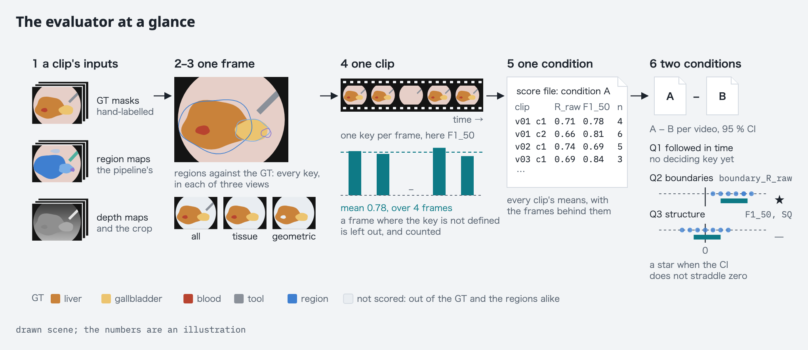

# evalkit

The code that turns the pipeline's output into the numbers the paper
reports. The full rules are in [`docs/evaluation.md`](../docs/evaluation.md);
this page is the short version, with a map of the parts.

## What it measures

The pipeline cuts every frame of a surgical video into regions and follows
them over time. It is not trained on surgery and it never names a region.
Against two public datasets with hand-labelled masks, the evaluator asks
three questions. Each is decided by one key, named here; the other keys help
explain the answer.

- **Given one frame as an example, how far can the regions be followed?**
  With no training, for how many frames does a region picked out once keep
  covering the same thing? *Decided by:* not settled yet. `time_IoU` is
  reported for reference, but it rewards coarse regions and cannot decide.
- **Given no example at all, what input makes the regions' boundaries fall
  where the labelled classes' boundaries are?** The image, the 3D shape from
  depth, or both; and for which classes and which procedures, since the
  answer differs between them. *Decided by:* `boundary_R_raw`, how many of
  the labelled boundaries the regions find, between conditions that differ
  in their input, within each of the three views below.
- **Given no ground truth, how much of the labelled structure is already in
  the regions?** Whether the things a surgeon would name are found, and how
  closely, before anyone names them. *Decided by:* `F1_50`, how many of the
  labelled things were found, with an extra region counted against it; and
  `SQ`, how closely the found ones match.

Each question is put as a comparison: the pipeline in one configuration,
a *condition*, against another. A claim gets a star when the video-level
bootstrap 95 % CI of the difference on the deciding key does not straddle
zero: whole videos are resampled, so that the clips of one video are not
counted as independent evidence. The rule is written once, in
`paired_stats`.

Every key is computed on three sets of classes, called *views*: all classes;
tissue only; and the tissue that depth and shape can separate. The third
question is judged on the last view. The second is answered within each
view: the views sort the classes by what should separate them, and the
conditions vary what the pipeline is given, the image, the depth or both.

## The map

Six steps, from a clip's inputs to the three questions: steps 2 to 5 score
one condition, and step 6 compares two.

The same steps, part by part: what each part computes, and the module that
holds it. Arrows say what is computed from what; Q1 to Q3 mark the parts that
hold the key deciding each question above. What a module returns is in its
docstring.

