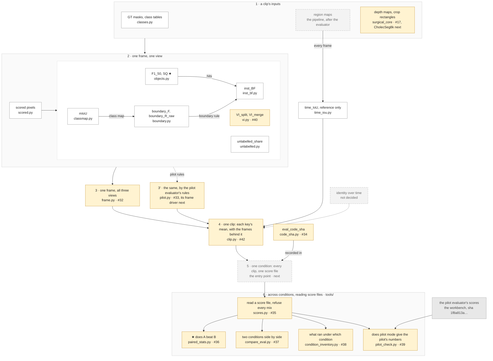

# evalkit

The evaluator specified in [`docs/evaluation.md`](../docs/evaluation.md). The
rules live there. This page says what the evaluator decides, and maps its
parts: one box per thing it does, with the module that holds it. What each
module returns, and the counts it keeps, is in that module's docstring.

## What it decides

The pipeline splits every frame of a surgical video into regions and tracks
them over time, without naming them and without training on the task. The
paper compares *conditions*, configurations of that pipeline, and claims that
one yields better regions than another. The evaluator turns "better" into a
yes or no.

"Better" is measured against the datasets' ground-truth masks on two numbers,
chosen before any score of this evaluator was seen:

- `F1_50`: are the GT objects found, with every extra region counted against
  the condition;
- `SQ`: how well the found ones fit.

Both in the *geometric* view, only the tissue that depth and shape can
separate, because that is what a pipeline built on depth and shape can be
asked to find. Tools, blood and the abdominal wall are scored too, in the
other views, but no claim rests on them.

A claim gets a star when the video-level bootstrap 95 % CI of the difference
between two conditions does not straddle zero, the one rule in
`paired_stats`. Every other key says *why* a condition scores as it does, and
is reported but never starred.

## The map

Six steps, from a clip's inputs to a star. Everything in `evalkit/` decides a
score and is hashed into `eval_code_sha`; the tools in `evalkit/tools/` only
read score files and are not hashed, so fixing one leaves every score
comparable.

The same steps, box by box: each box with the module that holds it and, until
it merges, its pull request. The only arrows are what is computed from what.

White: merged. Amber: under review. Dashed: not written yet, or not decided.
★: the two keys a claim is judged on, and the rule that gives the star. The
colours and numbers are updated as pull requests merge, and go once the port
is done, with `docs/porting.md`.

## How a pull request uses this page

One box per pull request. The description names the box and shows the map
with that box highlighted: a copy of the block above with one line added at
its end, `class clip here`, the box's id in place of `clip`. What the module
returns and the counts behind it go in the module's docstring. A pull request
that adds a box the map does not have changes the map first.
