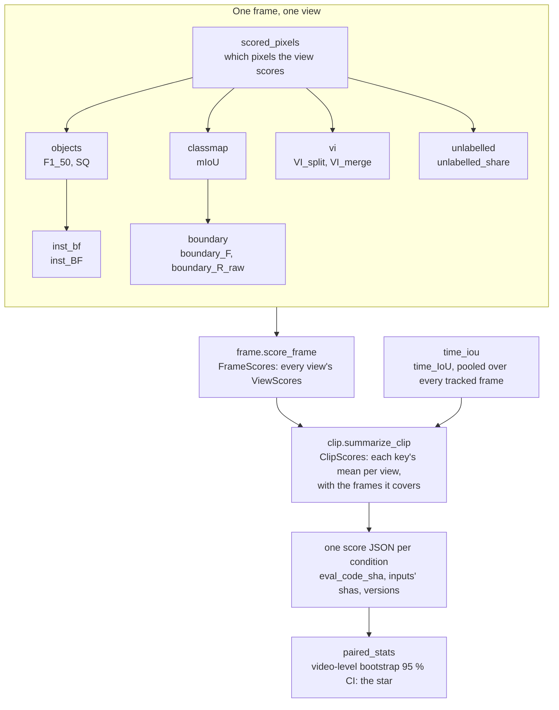

# evalkit

The evaluator specified in [`docs/evaluation.md`](../docs/evaluation.md). The
rules live there; this page shows how the scores are layered, from the pixels
of one frame to the star on a claim, and which module holds each layer.

## From pixels to a star

Every module on the frame level reads the same GT, region map and scored
mask, so each key is the value its module defines on the same pixels as the
others. A key that is not defined on a frame is `None` there, never `0`, and
the clip mean leaves the frame out and records how many it covers.

## The layers

| Layer | One value per | Module | Returns |
|---|---|---|---|
| Pixels | frame × view | `scored` | `Scored`: the scored mask, the GT classes, `PixelCounts` |
| Metric | frame × view | `objects`, `inst_bf`, `classmap`, `boundary`, `vi`, `unlabelled` | one dataclass each, the value with the counts behind it |
| Frame | frame | `frame` | `FrameScores`: `ViewScores` per view, or `excluded` |
| Clip | clip (× view) | `clip`, `time_iou` | `ClipScores`: `ViewSummary` per view, `time_iou` once |
| Condition | condition | the entry point | a score JSON, read by the tools |
| Claim | pair of conditions | `paired_stats` | the star, by the one rule in `AGENTS.md` |

The entry point that reads a dataset and writes the JSON, and the tools that
read it, are the next steps of [`docs/porting.md`](../docs/porting.md).
Pilot mode, which reproduces the pilot evaluator's numbers, shares the metric
modules and has a frame driver of its own.
